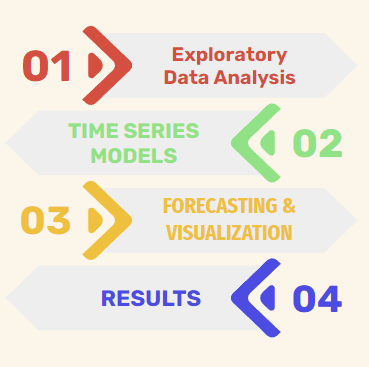
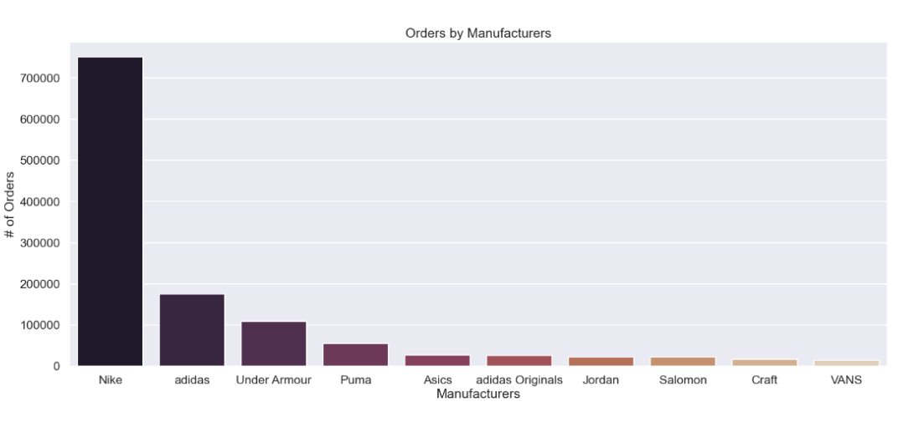
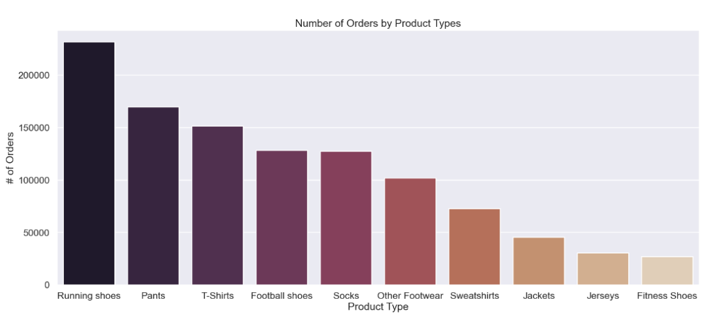
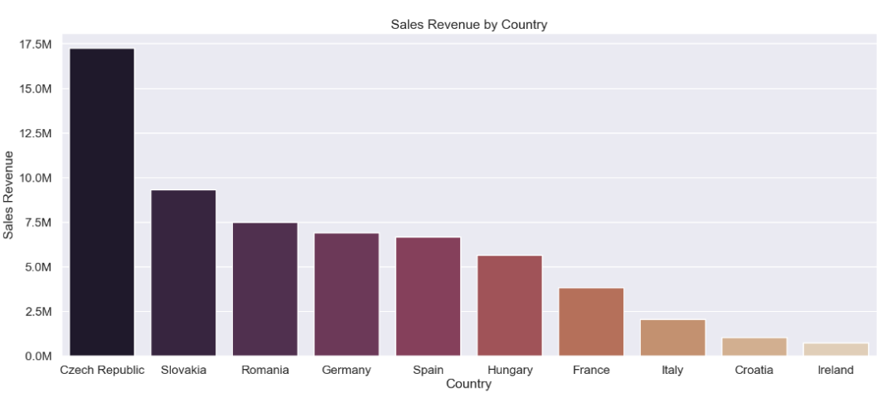
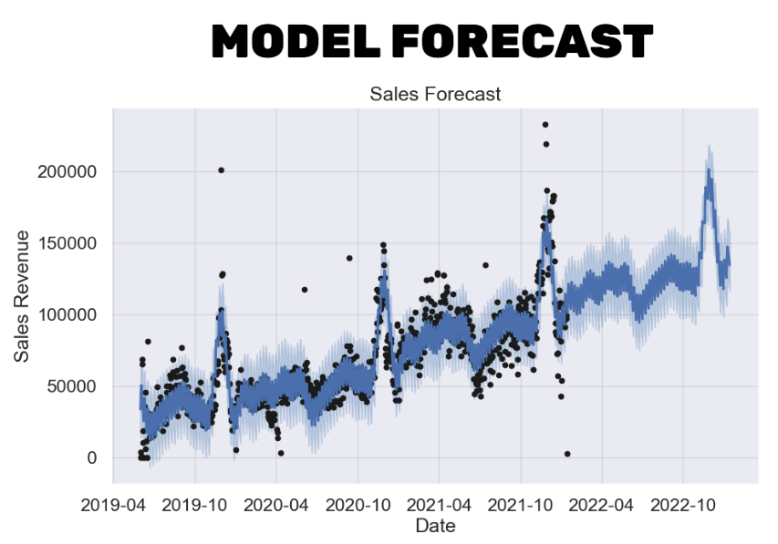

# Demand Prediction Using Time Series Analysis ⌛

This project is for the company Top4Sport which sells sports equipment across the EU. They operate out of the Czech Republic and sell equipment in more than a dozen countries across the EU. They would like me to help predict their sales revenue over time aswell as revenue for different countries and products. 

You can grab the data used for this project from [here](https://drive.google.com/drive/folders/1-OFljaA6cE8F2WI6HCcPD-8g5M72hywI?usp=sharing) and once downloaded please store these files within the `'data'` folder in the repositiory!

## Notebook Instructions 📄
This project is organized into data, images, and src folders:

 - [`'data'`](https://github.com/Jaghs/demand-prediction-project/tree/main/data): folder is there to store the csv files that will be downloaded from the google drive link above
 - [`'images'`](https://github.com/Jaghs/demand-prediction-project/tree/main/images): folder contains visualization created within the jupyter notebooks from EDA and from time series model outputs
- [`'src'`](https://github.com/Jaghs/demand-prediction-project/tree/main/src): folder contains 6 jupyter notebooks that were used to complete this project aswell a `'modules'` folder that contains python functions. The notebooks should be opened in this order:

  1. [`'eda_and_cleaning.ipynb'`](https://github.com/Jaghs/demand-prediction-project/blob/main/src/eda_and_cleaning.ipynb): Exploratory Data Analysis and data cleaning to prepare the dataset for modeling.

  2. [`'stationarity_and_timeseries_decomposition.ipynb'`](https://github.com/Jaghs/demand-prediction-project/blob/main/src/stationarity_and_timeseries_decomposition.ipynb): Analyzing the stationarity of the time series data and decomposing the time series into trend, seasonality, and residuals.

  3. [`'LSTM_model_daily.ipynb'`](https://github.com/Jaghs/demand-prediction-project/blob/main/src/LSTM_model_daily.ipynb): Building and training a Long Short-Term Memory (LSTM) model to forecast sales on a daily basis 

  4. [`'prophet_models.ipynb'`](https://github.com/Jaghs/demand-prediction-project/blob/main/src/prophet_models.ipynb): Building and training Prophet models, to predict sales for the entire dataset 

  5. [`'prophet_country_model.ipynb'`](https://github.com/Jaghs/demand-prediction-project/blob/main/src/prophet_country_model.ipynb): Building and training Prophet models to predict sales for each individual country 

  6. [`'prophet_products_model.ipynb'`](https://github.com/Jaghs/demand-prediction-project/blob/main/src/prophet_products_model.ipynb): Building and training Prophet models to predict sales for each individual product.

## Project Flow 🔄

In this project, I took several steps to analyze historical data and forecast future sales revenue for a client's business. Firstly, I loaded the historical data into a Jupyter notebook and conducted exploratory data analysis (EDA) by examining the dataset's shape, column data types, and missing values. For instance, I discovered that the payment column had many missing values on one specific day, which led me to infer that the payment systems were down that day. As a result, I removed these columns from the dataset. Secondly, I explored multiple time series models and ultimately chose the prophet model due to its superior results. Next, I used the prophet time series model to predict future sales revenue and generate insightful visualizations, which I analyzed in more detail later. Lastly, I compared the forecasted results with previous historical data to gain a better understanding of the client's business trajectory. Overall, these steps allowed me to generate valuable insights and provide actionable recommendations for my client.

## Findings 🔎

## Results 📊

Based from this model forecast:
- In one year, the sales revenue for the country of Czech Republic is predicted to increase over 73.57%. When looking at all European countries the sales revenue is projected to increase by over 50.04%. This will improve the cash flow for Top4Sports and provide my client with additional flexibility in managing day-to-day operations and pursuing growth opportunities.

- In one year the sales for running shoes in the Czech Republic will increase by 181.11% and for all the countries together the sales will increase by 80.46%. These results are highly insightful since they will help Top4Sport to manage inventory levels and prepare for demand increase

In conclusion, these results will help my client in making informed decisions related to accounting, financial planning, investment, and taxation.
